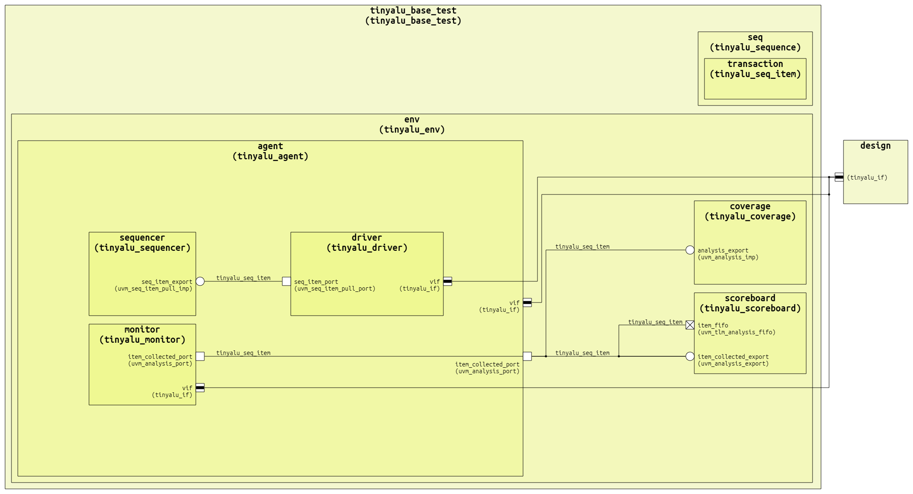
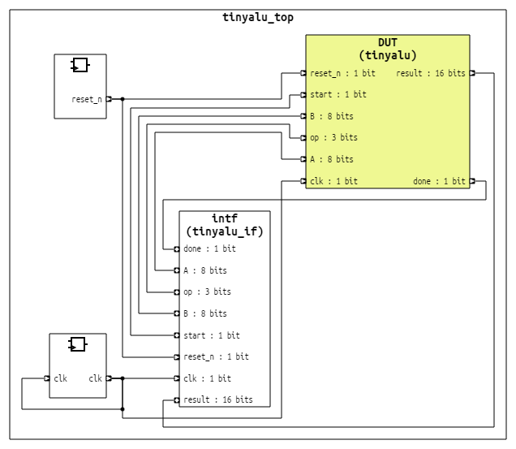
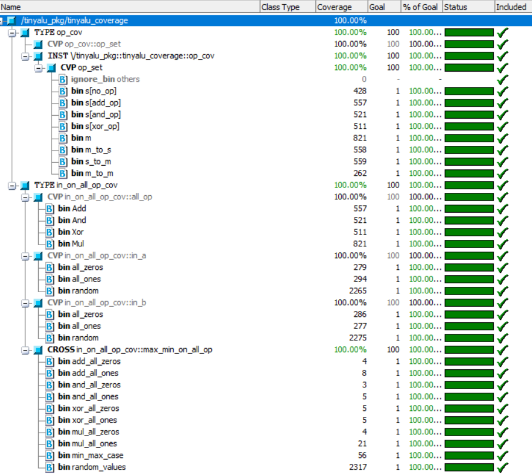

# tinyalu_uvm
A modular SystemVerilog UVM testbench for verifying an 8-bit TinyALU, featuring constrained random generation, functional coverage, and self-checking scoreboards.

## Architecture & Hierarchy

The environment follows a standard UVM Agent topology (`tinyalu_env`) containing an active Agent (Driver/Monitor/Sequencer), a Scoreboard for self-checking, and a Coverage collector.



## Testbench Top

The `tinyalu_top` module bridges the static RTL and dynamic UVM classes using a virtual interface (`tinyalu_if`) with clocking blocks for synchronization.



## Verification Results

We targeted 100% functional coverage on Opcodes (Add, Mul, etc.) and Data boundary values (0x00, 0xFF).



## How to Run

This project uses a TCL script (`run.do`) for compilation and simulation with Siemens Questasim/ModelSim.

**Terminal Mode:**

```
vsim -c -do "run.do"
```

**GUI Mode:**

```
vsim -do "run.do"
```

*P.S Comment out the (`quit -f`) line in (`run.do`)*